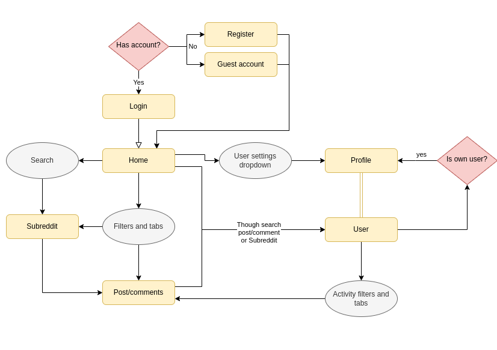
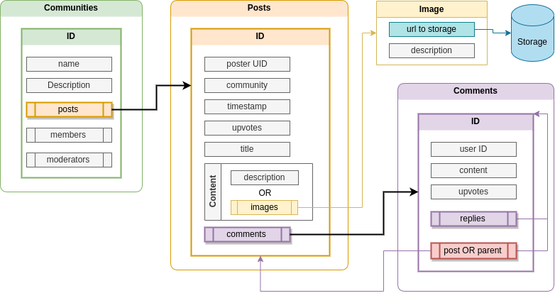

# Coralit - Surf everything

Coralit is a social media platform based on [Reddit](https://www.reddit.com/). It was developed as a personal project to learn and put together the skills of a front-end developer.

## Technologies

- React
- Jest
- Redux

## Development

Study of Reddit's structure

Database design for communities

Order of business:

1. Setup Firebase auth and storage OK
2. Login & Register page OK
3. Setup Communities database OK
4. Community interface
5. Community page
6. Post creation page
7. Comment creation interface
8. Setup upvotes (flexible order)
9. Setup user settings and subs
10. User/Profile page
11. Home page
12. Search interface
13. Home page filters (hot, best, new, etc)
14. User activity tabs (posts, comments)
15. (opt) Home side panels (communities leaderboard)

#### Auth

- Setup unique username filter (firebase-admin setup) OK
- add error handling UI OK
- add password patterns OK
- add styled-components red on invalid inputs (:invalid or using state/classes) OK
- add login validation OK
- add validation messages OK
- code Verify email interface, once verified make it redirect to home OK

- add username pattern for no spaces or special charaacters! OK

#### Community

- setup create community page OK
- setup community page
  - setup /submit page (post creation) or /login redirect OK
  - setup firebase fn to get posts OK
  - create post panel OK
  - setup firebase fn to join comm and leave, use button OK
- add community banner picture to community creation fn in firebase app
- setup security rules to handle email verified users authority OK / also with posts and comments!
- finish all firebase community fns OK
- buff community creation OK and add editing features on admin

#### Posts

- setup post creation (/submit)
- setup comment creation
- setup comment and post admin features

#### User profile page
